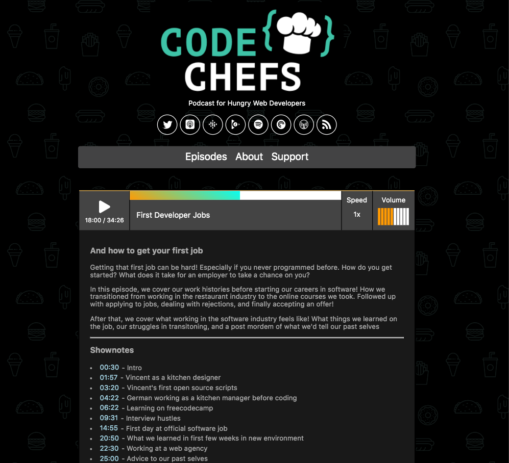

## Code Chefs Repo!

Source code to the [Code Chefs Podcast](https://codechefs.dev) site! Feel free to peruse around the source code, although it may be slightly messy

This theme is based on [Gatsby-Hooks-Starter-Theme](https://github.com/vincentntang/gatsby-hooks-starter-theme), another theme I made

Some of the coolest parts of this repo are the following:

1. A custom React Audio Library that controls playback speed, volume levels, and timestamps that can autoplay
2. Fully responsive sass library support based on this [scss library](https://github.com/vincentntang/freshpoint) I made

## Installation Notes

If you want to install and fork this theme yourself, fork the repo here. To install, run this:

```
npm install
npm run dev
```

## Future Roadmap

10/7/20 Notes:

I will be releasing the React audio library as a standalone npm package later on. It has some bugs right now that need to be worked out. Mostly when it comes to dynamically rendering the timestamps that allow you to jump to different timestamps. Currently it attaches a method to the global `window` object because React does not see any local functions when dynamically rendered using `dangerouslySetInnerHtml`