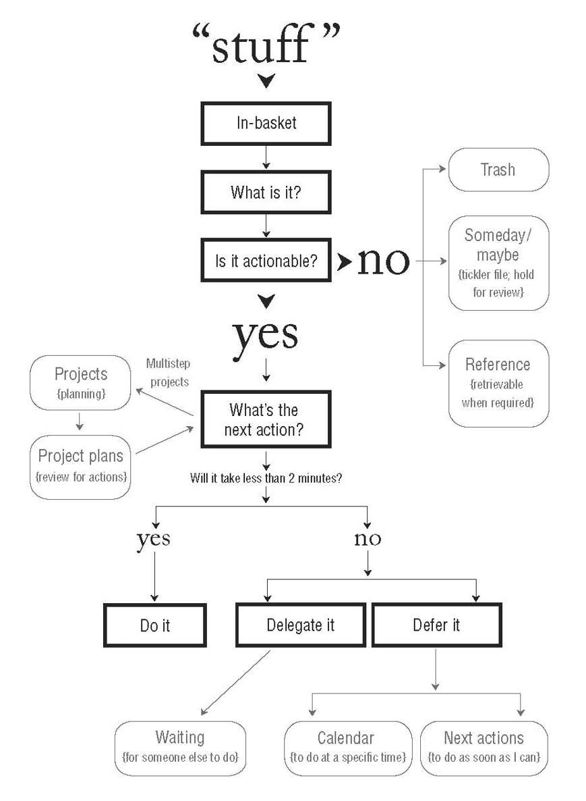

Productivity is the defined ratio of output volume to volume of inputs. There's processes such as the Getting-Things-Done method for determining how to get work done.

Time management and finding periods of focus work helps in getting your work done in one go. You can build upon better productivity habits by making good habits easier, and hard habits harder

## What is productivity?

**01:00**

Productivity is defined as the ratio between the output volume to the volume of inputs. The higher the value, the more productivity you are. 

Inputs are things usually measured as labor and capital to product a given output or a goal.

That's the definition in the broadest sense. Being productive generally means you get more done throughout the day and reach goals you wish to achieve. 

Whether those goals are personal or work based, those are up to you. 

Maybe you want to be a better friend or family member. Maybe you have that itch for a side project you want to finish, but never get around to because you always procrastinate. 

Maybe you want to be more physically fit.

In any case, you need to measure how you will achieve these goals to be productive. For being physically fit, maybe this is losing weight if your on a weight loss. 

You can measure the changes in your nutrition and diet over time and see if those changes reflect the goal your striving towards

**06:00**

With productivity, there comes organization. How you organize yourself depeneds on your personality type. For instance, engineers tend to be INTP(Introverted intuition, thinking, physical). We'll cover this further in this podcast

We breakdown how we define productivity based on self-help books we've read

## Getting Things Done

**09:30**

Getting things done by David Allen is probably the best approach to "how" to be productive. It lists a holistic approach on how to break down tasks to get a desired result.

Whether these tasks are for your personal or work life, it does not matter.

For instance, let's say you get an email. If this email is informational or a spam promotion, you probably don't need to do anything here.

But let's say this email is something you have to do, such as sending some tax forms to your accountant. Is this something you can do in 5 minutes?

Maybe you have that document and can send it off right away. 

But let's say you have to get this document from someone else. You might delegate it instead, aka request that document from your employer.

You can follow back up when it's finished.

However, let's say the task is "Build this project for this client". Now that's not doable in 5 minutes.

At this point you would need to break this down into smaller chunks. Maybe you can have a phase for planning the project, and another for building it.

Within those subtasks, there may be more tasks such as "make mockups" with more concrete deliverables.

Heck you might need to make a task for using a tool to help write / manage these tasks such as Trello or Jira.

**14:30**

### Decision Matrix

Making decisions against task can be done using a tool called the Eisenhower decision matrix. It's used to determine the priority order for a task

We can break this down into 4 forms

- Urgent important -> do this first
- Not urgent important -> schedule these
- Urgent not important -> delegate
- Not important, not urgent -> avoid

### Time Management

**20:00**

For time management, seperating things by personal and work calendars is a good idea. You can use seperate notetaking tools like Notion to manage your workflow. 

Another good strategy is timeboxing certain hours for work. Or changing up your environment once work is finished.

You can set reminders to yourself on a calendar and timebox focus periods as well

## Atomic Habits

**24:00**

Everyone has good and bad habits. To build better good habits, make them easier to do. 

This makes you more likely to do that good habit over time. If you do it enough times, it becomes a habit.

A good example of this is waking up in the morning. If you sleep early, waking up earlier is easier.

If you have bad habits preventing this, consider making them harder. 

Say for instance going on social media keeps you up at night. You can force your phone to do-not-disturb for a given time frame so you don't go on there.

Other ways of making habits easier is to also make things more visible. If you want to weigh yourself every time, consider putting that scale in plain sight

## 4 Hour Workweek

**30:30**

Automate as much boring work as possible. Or things that are easy to delegate with a clear outcome. This frees up your time so you can focus on things you care about

## Toyota Way Process

**34:30**

Toyota pioneered a technique called LEAN. Agile/scrum are derived from this. LEAN is the principle and holistic approach for analyzing and prioritizing things that matter. 

You look at that lifecycle and see what things matter in there. The ones that matter is called MUDA, or wasted effort. You can eliminate those from your schedule if it doesn't add value to your life.

A good example of this is eating breakfast in the morning. You can just drink a protein smoothie instead of making a traditional breakfast. 

From a development standpoint, this could mean having your tools open and ready at any point for developing. 

This way you don't have to open up vscode, find your code snippets, etc because it's already open. This might mean you don't turn off your computer all the time.

Don't overly automate though. 

## Life changing magic of tidying up

**45:00**

If your room is messy, clean it up all in one shot. 

It takes a certain amount of time to get in the mood to clean, and by splitting this over two days, things take longer. 

You'll also feel much better by cleaning things and the next day you can relax.

This principle applies to work. Get all your work done in one shot so you can take it easy the rest of the day.

Another core principle in this book is spark-joy. Make your life enjoyable by adding small fun things to it.

This could be adding whipped cream on your breakfast smoothie in the morning.

## Deep Work by Cal Newport

**47:00**

Plan focus periods during your workweek. Up to 2 work periods a day. Focus on one problem or one domain for those focal periods.

They should last a few hours for each focus sessions. Don't get distracted during these hours.

The premise is you need to dedicate every mental resource for solving those problems.

For timeframes where you don't have as much time, this is best for doing administrative work.

If you have space in your house, you should have a dedicated deep-work spot. This is most likely your office.

Certain music can be used to trigger "focus-periods". Any non-vocal music is good such as chill-hop or lofi.

## Thinking Fast and Slow

**51:30**

There is fast thinking and slow thinking. System 1 and System 2.

We're only capable of only so much slow-thinking per day. If your first learning how to do software development, this is slow-thinking System 2

You have to wrap your head around programming paradigms and language syntax.

But let's say you have 10+ years of experience in doing PHP development.

Doing PHP development at that point is System 1 since you've done it so many times.

The more experienced you get a task, the more intuitive it becomes.

The goal is to create as many System 1 thought processes for software development.

## Other notes:

**58:30**

Don't overly optimize and don't overly garden your productivity systems. Make sure you focus on your goals first. 

Consider using low tech and known solutions for solving problems.

Think about how often you want to be productive. It's not always good to be overly productive.

#### DESSERT TIME! - Dancing and New Jobs

**54:00**

Vincent talks about turning 30 and German talks about starting a new job

## Social Media

- [German's Twitter](https://twitter.com/germangamgon)
- [Vincent's Twitter](https://twitter.com/vincentntang)
- [Vincent's Instagram](https://instagram.com/vincentntang)
- Tweet us your thoughts on [@codechefsdev](https://twitter.com/codechefsdev)

## Links

- [Getting Things Done](https://www.amazon.com/Getting-Things-Done-Stress-Free-Productivity/dp/0143126563/ref=sr_1_1?dchild=1&keywords=getting+things+done&qid=1616387410&sr=8-1)
- [Atomic Habits](https://www.amazon.com/Atomic-Habits-Proven-Build-Break/dp/0735211299/ref=sr_1_1?dchild=1&keywords=atomic+habits&qid=1616387457&sr=8-1)
- [4 hour workweek](https://www.amazon.com/4-Hour-Workweek-Escape-Live-Anywhere/dp/0307465357/ref=sr_1_1?dchild=1&keywords=4+hour+work+week&qid=1616387501&sr=8-1)
- [Toyota Way Process](https://www.amazon.com/Toyota-Way-Management-Principles-Manufacturer/dp/0071392319/ref=sr_1_2?dchild=1&keywords=toyota+way+process&qid=1616387523&sr=8-2)
- [Life Changing Magic of Tidying Up](https://www.amazon.com/Life-Changing-Magic-Tidying-Decluttering-Organizing/dp/1607747308/ref=sr_1_2?crid=20QCXVV8WI7BC&dchild=1&keywords=life+changing+magic+of+tidying+up+book&qid=1616387543&sprefix=life+changing+magi%2Caps%2C199&sr=8-2)
- [Deep Work](https://www.amazon.com/Deep-Work-Focused-Success-Distracted/dp/1455586692/ref=sr_1_1?dchild=1&keywords=deep+work+cal+newport&qid=1616387566&sr=8-1)
- [Thinking Fast and Slow](https://www.amazon.com/Thinking-Fast-Slow-Daniel-Kahneman/dp/0374533555/ref=sr_1_1?dchild=1&keywords=thinking+fast+and+slow&qid=1616387589&sr=8-1)